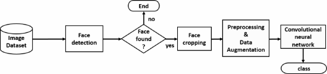

FACIAL EMOTION RECOGNITION
Innocent Opara(s5630105)

ABSTRACT

There has been a surge of interest amongst researchers and companies in the study of facial emotion recognition due to its importance in human-computer intereactions, robotics, health care, etc just to mention a few. Using a CNN-based classification technique, the primary goal of this study is to develop a precise and efficient system for facial emotion detection and recognition. A model that can accurately classify facial expressions into distinct emotions, and convolutional neural networks are best suited for this task. The project made use of the face expression dataset from Kaggle.

1. INTRODUCTION

Facial expression recognition and facial emotion recognition are terms that are used interchangeably in this project to refer to the same concept. The goal of facial emotion identification is to use machine learning techniques to train the algorithm to automatically identify and categorise common human emotions, such as disgust, sorrow, happiness, anger, enthusiasm, surprise, and neutral. Four steps are usually included in the process of recognising facial emotions: face input/database face image, preprocessing, feature extraction, and classification. In this project we used CNN based classification, Convolutional Neural Network(CNN) is a complete model with combined feature extraction and classification that draws inspiration from neuroscience. Without the need for an additional procedure, we can input the raw data and obtain the final classed labels.

2. LITERATURE REVIEW

For image detection, recognition, and classification tasks, CNN have established itself as a potent class of model. Tens of millions of parameters allow CNNs to handle large training sets, and the "features" that the networks learn are entirely automatic with no human hand crafted characteristics are required at all[6]. Thus, one may consider CNN to be an effective automated feature extractor. Inspired by the outcomes CNNs have produced, I apply the network to this project and assess its effectiveness. Other models carried out in this project includes logging, checkpointing and early stopper. I also will be looking at a critical practice in software engineering and machine learning which is called unit testing.  

3. DATASET DESCRIPTION:

I made use of kaggle dataset on facial expressions recognition. The dataset is divided into a training folder with 28,716 images and a test folder with 7,185 images. The 7 different emotions labeled are 0= angry, 1 = disgust, 2 = fear, 3 = happy, 4 = neutral, 5 = sad and 6 = surprise [4]. The dataset was preprocessed and visualization of some of the images were carried out.

 (1).png>)

Fig 1. An example of the image from the dataset.

3.1. PYTHON FUNCTIONS USED
Some of the functions/libraries used includes the following:

(a) we used import pandas as pd for data analysis and visualization, also we used the import torch function to import the pytorch library. other libraries imported included import os, and import multiprocessing as mp.

(b) load_image_tensor: The load_image_tensor function was used to load images from the file and convert it into a tensor. It was basically used for the preprocessing of the images.

(c) custom_collate_fn: It was used to load the images in batches from the dataset. the batch size for the project was 100.

(d) torch.utils.data import DataLoader: The data loading function used for the project is from torch.utils.data import DataLoader, random_split. 

3.2. VISUALIZATION FUNCTION

The following are the functions/ libraries used for the visualization of this project:

(a) from PIL import Image: The function is used to import the Image module from the Python Imaging Library (PIL).

(b) import matplotlib.pyplot as plt: This function is often used in data visualization tasks, including the creation of various types of plots and charts.

4. MODEL DESCRIPTION:

The model describes two basic steps which includes data preprocessing/loading and CNN.

4.1 DATA PREPROCESSING/LOADING

The model typical involed the preprocessing of the dataset using the functions stated above in 3.1. Preprocessing also involves cleaning and features extraction. (Verma and Rani, 2021) [5] it is the duty of the preprocessing algorithm to end the operation as shown in Fig 2. Also, the primary task of feature extraction is to pattern and correctly assign it to a possible output class [6]. 

Fig 2. Process of Data preprocessing [3]

The general overview of FER is described in the Fig shown below. when there are no images to be processed, the algorithm truncate the process as shown in Fig 2.

Fig 3. The above is an overview of the stages involved in facial emotion recognition [1].

4.2 CONVOLUTIONAL NEURAL NETWORK(CNN)

A CNN is a Deep Learning algorithm which is highly efficient for visual models. It is said to be the most popular for image classification [5]. It learns the differences in inages and helps us differentiate images from one another. The factor that separates CNN from other algorithms is its learning capabilities which is a derivative of the human brain’s neural network. 

For this project, I used a simple CNN function known as get_simple_conv_net(). Also, I provided a training loop for the neural network using pytorch. Other information from the results shows the following:

 
Fig 4. The above shows a simple image description of the CNN layers and process.

5. RESULT AND DISCUSSION

The model begins with a convolutional layer with 16 output channels followed by activation and max pooling.The model has 7 layers and memory requirements are estimated to be around 5.22 megabytes during operation.This architecture is a simple convolutional neural network (CNN) designed for image classification.
 
Summary of the results are as follows:

(a) Conv2d-1 (Convolutional Layer): Output Shape: [-1, 16, 48, 48].

(b) ReLU-2 (Rectified Linear Unit Activation): Output Shape: [-1, 16, 48, 48].

(c) MaxPool2d-3 (Max Pooling Layer): Output Shape: Output Shape: [-1, 16, 24, 24].

(d): Flatten-4: Output Shape: [-1, 9216].

(e) Linear-5 (Fully Connected Layer): Output Shape: [-1, 128].

(f) ReLU-6 (Rectified Linear Unit Activation): Output Shape: [-1, 128].

(g) Linear-7 (Output Layer):Output Shape: [-1, 10].

(h) Final test accuracy for 17944 examples: 55.39456. Testing batch[560/561]

In summary, the model achieved a final test accuracy of 55.39% on a dataset of 17,944 examples. The accuracy is typically used to assess how well the model generalizes to new, unseen data.

CONCLUSION

The automation of facial expressions analysis has been crucial to machine and human interaction and has gained significant attention in the last decades.Early stopping which helps saves time and computing power was also discussed. The project contained a logging tool called tensorboard used to keep track of the metrics and visualize performance. Furthermore, checkpointing was highlighted in the project which refers to saving at specific times during the training process. The future of Facial emotion recognition is bright, and its application will only continue to increase into various fields. 

REFERENCES 

[1] .Revina, I. Michael. and Emmanuel, W. R. S., 2018. A Survey on Human Face Expression Recognition Techniques. Journal of King Saud University - Computer and Information Sciences, 33 (6). 

[2] Jaiswal, R., 2020. Facial Expression Classification Using Convolutional Neural Networking and Its Applications. 2020 IEEE 15th International Conference on Industrial and Information Systems (ICIIS), 10 (11). 

[3] Ahmed, T.U., Hossain, S., Hossain, M.S., Islam, R. ul and Andersson, K. (2019). Facial Expression Recognition using Convolutional Neural Network with Data Augmentation. [online] IEEE Xplore. doi:https://doi.org/10.1109/ICIEV.2019.8858529. 

[4]  https://www.kaggle.com/datasets/chiragsoni/ferdata 

[5] Ahmed, T.U., Hossain, S., Hossain, M.S., Islam, R. ul and Andersson, K. (2019). Facial Expression Recognition using Convolutional Neural Network with Data Augmentation. [online] IEEE Xplore. doi:https://doi.org/10.1109/ICIEV.2019.8858529. 

[6] Kumar, G. and Bhatia, P. K., 2014. A Detailed Review of Feature Extraction in Image Processing Systems. 2014 Fourth International Conference on Advanced Computing & Communication Technologies, 10 (74). 

[7] Visualization of the result, checkpointing and final training loop were referenced from the class notes